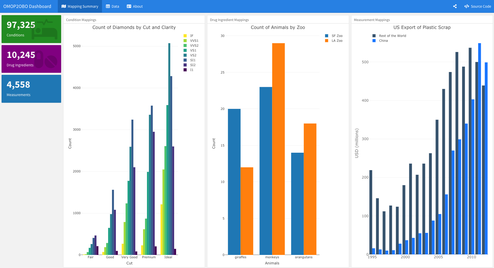
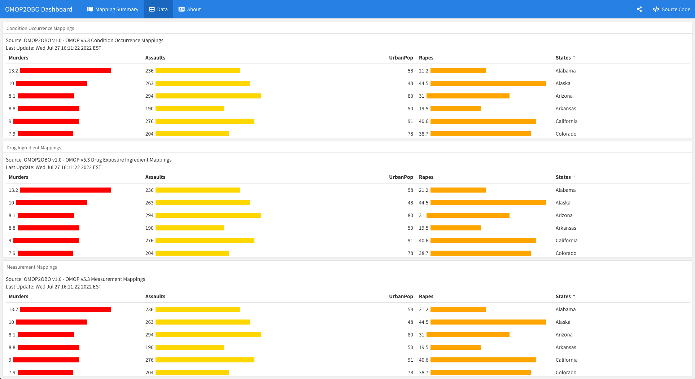

# OMOP2OBO Dashboard

The OMOP2OBO Dashboard provides updated statistics, data, and information about the most up-to-date OMOP2OBO mappings. This dashboard is built with R using [`Rmakrdown`](https://rmarkdown.rstudio.com/) and [`flexdashboard`](https://rmarkdown.rstudio.com/flexdashboard/) framework

 

**OMOP2OBO**  
For more information on the OMOP2OBO algorithm or mappings please see the primary GitHub site: https://github.com/callahantiff/OMOP2OBO.  

 

**Contact**  

We’d love to hear from you! To get in touch with us, please join or start a new [discussion](https://github.com/callahantiff/OMOP2OBO_Dashboard/discussions), create an [issue](https://github.com/callahantiff/OMOP2OBO_Dashboard/issues) or send us an [email](https://mail.google.com/mail/u/0/?view=cm&fs=1&tf=1&to=callahantiff@gmail.com) 💌
